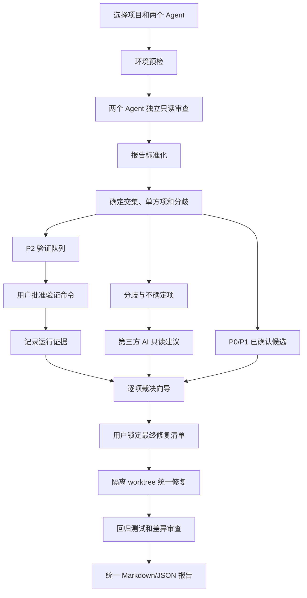

# Herdr Consensus 设计与实施文档

> 文档状态：已批准，首发候选；全部发布门槛验证通过（含第三轮审查与独立维护者签核）
> 当前阶段：阶段 12 — 全部发布门槛已验证通过，等待维护者的 commit / 发布决策
> 下一阶段：由维护者决定是否提交脏 `main` 工作区并发布（AI 不自动 commit/merge/push）
> 最后更新：2026-08-18

## 1. 项目摘要

Herdr Consensus 是一个独立的 Herdr 插件，用来把两个本地 Coding Agent 对同一项目的独立审查，转化为一份可验证、可裁决、可追踪的统一修复计划。

核心流程固定为：

1. 两个 Agent 在彼此隔离、互不可见的上下文中审查同一项目。
2. 插件收集并标准化两份报告。
3. 确定交集、单方发现和真正的分歧。
4. P0/P1 已确认问题进入“必须修复”候选集。
5. P2 问题先生成验证方案，运行后归类为已确认、已排除或仍不确定。
6. 分歧项和仍不确定项交给第三方 AI 提供只读建议。
7. 用户在逐项裁决向导中作最终决定。
8. 把已确认 P0/P1、验证成立的 P2、用户批准的争议项合并为一份不可静默变更的修复清单。
9. 用户批准后，在隔离 Git worktree 中统一修复、测试和回归。
10. 导出包含证据、决定、修改和测试结果的统一报告。

本插件的定位是“多 Agent 审查共识与人工裁决层”，不是新的通用 Agent 编排器，也不替代 Herdr。

## 2. 目标与非目标

### 2.1 产品目标

- 支持 Herdr 已支持的任意 Agent 类型，不把实现绑定到 Codex 或 Claude Code。
- 支持“插件启动两名 Agent”和“导入两份现有报告”两种入口。
- 把严重程度与处理状态分开，避免把 P1、已确认、分歧混成一个概念。
- 对自动匹配保持保守：宁可交给用户确认，也不错误合并两个不同问题。
- 第三方 AI 只提供建议，不拥有最终决定权，也不能在仲裁阶段修改代码。
- 所有重要操作可恢复、可追踪；关闭 Herdr 后可以继续同一次审查。
- 默认不向外部服务上传代码；实际使用哪个 Agent、模型和命令必须记录在报告中。
- 面向新手：每一步说明当前发生什么、为什么、下一步是什么。

### 2.2 非目标

- 不修改或 fork Herdr 核心。
- 不自建模型服务，不代理或保存用户的模型 API Key。
- 不声称 AI 报告等同于真实缺陷；没有证据的结论必须标记为未验证。
- 不在 v1 自动合并分支、推送远程仓库、创建 PR、部署或执行数据库迁移。
- 不在 v1 替代 SAST、依赖漏洞扫描、移动端真机测试或人工安全审计。
- 不在非 Git 项目中自动修改代码；这类项目只能完成审查、裁决和导出修复计划。

## 3. 核心概念

### 3.1 严重程度

| 等级 | 定义 | 默认处理 |
| --- | --- | --- |
| P0 | 可造成广泛数据破坏、远程利用、生产完全不可用等紧急问题 | 阻止后续发布；确认后必须进入修复清单 |
| P1 | 可复现崩溃、重要数据丢失、权限绕过、主流程不可用 | 确认后必须进入修复清单 |
| P2 | 有实际影响，但需要特定条件、运行验证或影响有限 | 先验证；验证成立后进入修复清单 |
| P3 | 低风险缺陷、可维护性问题或非阻塞改进 | 默认记录和延期，用户可主动加入修复清单 |

严重程度不是证据强度。一个 Agent 声称某项为 P0，不代表该项已经确认。

### 3.2 处理状态

- `common_confirmed`：两份报告指向同一问题，证据相容，没有实质冲突。
- `single_source`：只有一个 Agent 提出，需要补充证据或用户判断。
- `needs_validation`：需要运行命令、测试、复现步骤或环境信息才能确定。
- `disputed`：两个 Agent 对问题是否存在、严重程度、根因或修复方式有实质冲突。
- `validated_true`：运行验证支持问题存在。
- `validated_false`：运行验证支持问题不存在或已被现有保护覆盖。
- `inconclusive`：验证无法完成或结果不足。
- `approved_fix`：用户批准进入最终修复清单。
- `deferred`：用户确认存在但本轮延期。
- `rejected`：用户决定本轮不处理，并保留理由。

### 3.3 证据等级

由强到弱：

1. `runtime_reproduced`：实际复现、测试失败、崩溃日志或可重复命令结果。
2. `code_proven`：代码路径与条件可以静态证明，包含准确文件和位置。
3. `corroborated`：两个独立 Agent 提出相容结论，但尚未运行复现。
4. `agent_asserted`：只有 Agent 文字判断，没有足够代码或运行证据。
5. `unknown`：来源或证据无法解析。

## 4. 用户工作流



### 4.1 新手默认路径

1. 在目标仓库的 Herdr pane 中运行“New consensus review”。
2. 插件自动发现 Herdr、Git、Node.js、可用 Agent 和当前仓库。
3. 系统推荐两个不同的 Agent，用户可以替换。
4. 显示将要发送的只读审查提示，用户确认后启动。
5. 两个 Agent 完成后自动进入比较页。
6. 需要验证的命令逐条展示；任何命令执行前都需要用户批准。
7. 系统为第三方建议者推荐一个与前两者不同的 Agent；用户可以接受或替换。
8. 用户逐项选择“修复、延期、不处理”。
9. 插件生成带摘要哈希的最终修复清单，再次确认后才进入修改阶段。

### 4.2 已有报告入口

用户可以导入 Markdown、纯文本或符合 schema 的 JSON 报告。导入内容仍要经过标准化和来源标记，不假设其来自可信 Agent。

## 5. 系统架构

### 5.1 总体结构

```text
Herdr plugin action / CLI
          |
          v
   Run Orchestrator
     |    |     |
     |    |     +--> State Store / Audit Log
     |    +--------> Herdr Agent Adapter
     +-------------> Import Adapter
          |
          v
   Report Normalizer
          |
          v
   Consensus Engine
     |           |
     v           v
Validation     Third-AI Arbiter
 Planner             |
     +--------+-------+
              v
      Decision Wizard
              |
              v
       Locked Fix Plan
              |
              v
   Worktree Fix Executor
              |
              v
      Unified Reporter
```

### 5.2 组件职责

#### Herdr Agent Adapter

- 通过官方 `herdr` CLI 调用 Agent 能力，不解析私有 socket 协议。
- 使用 `HERDR_PLUGIN_CONTEXT_JSON`、`HERDR_WORKSPACE_ID`、`HERDR_TAB_ID`、`HERDR_PANE_ID` 锁定调用上下文。
- 使用 `herdr pane split --current --direction right --cwd ... --no-focus` 创建 pane（阶段 12 烟雾测试确认 Herdr 0.8.0 要求显式 `--direction`）。
- 使用 `herdr agent start <name> --kind <kind> --pane <id>` 启动用户选择的 Agent。
- 使用 `herdr agent prompt ... --wait` 提交任务并等待稳定状态。
- 使用 `herdr agent get/read` 获取状态和输出。
- 使用 `herdr agent list`（返回 JSON）发现当前会话中已识别的 Agent；阶段 1 的 `doctor` 用它报告可用 Agent。
- 所有公开 ID 视为不透明字符串；不从 ID 格式推断状态。
- Agent 启动失败、阻塞或退出时保存现场，不自动重启超过一次。
- 新建审查使用由 `run_id` 派生且满足 Herdr 命名规则（小写字母开头，≤32 字符）的唯一 Agent 名称，避免同一 Herdr workspace 内重复运行时与旧 Agent 名冲突。
- Herdr 0.8.0 在部分非零退出场景会把 JSON error envelope 写到 stderr；适配器必须同时解析 stdout/stderr，不能把可分类错误降级为 protocol failed。

#### Report Collector

- 为两名审查者生成同一份、版本化的审查契约。
- 两名 Agent 不得读取对方的输出、标准化结果或提示补充内容。
- 要求终端输出在唯一标记之间返回 JSON；不要求 Agent 向目标仓库写文件。
- JSON 解析失败时最多发送一次格式修复请求；再次失败则保存原始输出，转为人工导入。
- 保留原始输出及 SHA-256，标准化报告不能覆盖原文。

#### Report Normalizer

- 用 Zod schema 校验报告版本和字段。
- 将绝对路径转换为仓库相对路径；拒绝 `..` 越界和仓库外路径。
- 将各 Agent 的严重程度文字映射到 P0–P3，并保留原始等级。
- 统一行号、符号名、类别、根因、影响、证据、复现步骤和建议修复。
- 对无法确定的值使用显式 `null` 或 `unknown`，禁止自行补造。

#### Consensus Engine

- 第一层使用确定性规则匹配：相同文件、重叠行区间、相同符号、相同类别和相同错误标识。
- 第二层使用本地文本相似度计算候选分数，不调用模型。
- 建议权重：路径 0.30、位置/符号 0.20、类别 0.15、标题与根因 token 0.25、修复意图 0.10。
- 分数 `>= 0.80` 且不存在互斥证据时自动合并。
- 分数 `0.55–0.79` 标为“可能相同”，交给第三方 AI 判断是否同一问题，并在用户界面显示两份原文。
- 分数 `< 0.55` 保持为两个独立发现。
- 自动合并后的严重程度取更高等级，但报告必须显示两名 Agent 各自的原始判断。
- 下列情况强制标记为 `disputed`：存在/不存在冲突、根因互斥、修复方案互斥、严重程度相差两级以上、一个报告认为已有保护而另一个认为保护失效。

#### Validation Planner

- 从发现中的复现步骤、项目类型和现有脚本生成候选验证命令。
- 只建议仓库已有、可解释的检查入口，例如 `npm test`、`pnpm test`、`cargo test`、`pytest`、`go test ./...`、`./gradlew test`。
- Agent 提供的任意 shell 字符串不能直接执行。
- 禁止或要求额外确认的内容包括：`sudo`、删除命令、磁盘格式化、远程部署、数据库迁移、凭据读取、`curl | sh`、向生产服务写数据。
- 每条命令先展示 cwd、argv、预计写入范围和超时；使用参数数组启动，不经 shell 插值。
- 保存 stdout、stderr、退出码、耗时、环境摘要和输出哈希。
- 结果只能是 `validated_true`、`validated_false` 或 `inconclusive`；失败执行不等于问题成立。

#### Third-AI Arbiter

- 系统优先推荐未参与前两份报告的 Agent；用户可以选择其他已安装 Agent。
- 启动独立、只读的新会话，不能看到用户未授权的其他项目或历史会话。
- 输入包含：争议项原文、相关代码片段、已执行验证结果、项目规则和严格输出 schema。
- 输出必须包含：建议结论、理由、引用证据、置信度、仍缺少的验证、推荐用户动作。
- 第三方 AI 不能修改代码、不能改变原始报告、不能替用户作最终决定。
- 若第三方 AI 与前两个 Agent 使用相同模型或同一提供商，界面显示“独立性较弱”提示。
- 解析失败时允许一次格式修复；失败后保留为 `inconclusive`，不得悄悄采用自然语言结论。

#### Decision Wizard

- 默认使用逐项向导，而不是一次展示超长报告。
- 每页同时显示：两个 Agent 的原文、标准化摘要、证据、验证结果、第三方建议和差异说明。
- 用户动作固定为：`加入修复`、`延期`、`不处理`、`返回补充验证`。
- 每个决定记录时间、选择、可选理由和当时证据哈希。
- 用户可以返回修改未锁定决定；锁定后任何变化都生成新的修复计划版本。

#### Locked Fix Plan

- 汇总三类内容：已确认 P0/P1、验证成立的 P2、用户批准的争议或单方项。
- P3 只有用户明确选择后才能加入。
- 生成 `fix-plan.json` 和 `fix-plan.md`，并对规范化 JSON 计算 SHA-256。
- 任何后续实现提示都引用 `run_id`、计划版本和哈希。
- 实现 Agent 不得增加未在清单中的顺手重构；新发现要回到裁决流程形成新版本。

#### Worktree Fix Executor

- v1 自动修改仅支持干净的 Git 仓库。
- 在独立 worktree 和独立分支中执行修改，不直接写主工作目录。
- 用户选择一个写入 Agent；默认不让两个 Agent 同时改同一份代码，避免冲突和责任不清。
- 写入 Agent 接收锁定清单、验收条件和禁止范围。
- 每完成一个问题运行其针对性测试；全部完成后运行项目级回归命令。
- 不自动 commit、merge、push、创建 PR 或发布。最终由用户审查 diff 后决定。

#### Unified Reporter

- 导出 Markdown 和 JSON。
- 包含运行元数据、Agent/模型信息、原始发现映射、共识结果、验证命令与结果、第三方建议、用户决定、最终修复清单、实际变更文件和回归结果。
- 报告明确区分事实、Agent 判断、第三方建议和用户决定。

## 6. 数据模型

以下接口名称在实现中视为稳定契约；调整前必须先修改本文档。

```ts
type Severity = "P0" | "P1" | "P2" | "P3";
type EvidenceTier =
  | "runtime_reproduced"
  | "code_proven"
  | "corroborated"
  | "agent_asserted"
  | "unknown";

interface SourceLocation {
  path: string;
  startLine: number | null;
  endLine: number | null;
  symbol: string | null;
}

interface RawReportArtifact {
  sourceId: "agent_a" | "agent_b" | "third_ai" | "import";
  agentKind: string;
  model: string | null;
  capturedAt: string;
  content: string;
  sha256: string;
}

interface NormalizedFinding {
  findingId: string;
  sourceId: string;
  originalSeverity: string;
  severity: Severity;
  title: string;
  category: string;
  location: SourceLocation | null;
  rootCause: string | null;
  impact: string;
  evidence: string[];
  evidenceTier: EvidenceTier;
  reproduction: string[];
  suggestedFix: string | null;
  needsRuntimeValidation: boolean;
  rawArtifactSha256: string;
}

interface ConsensusItem {
  itemId: string;
  findingIds: string[];
  relation: "common" | "single_source" | "possible_match" | "disputed";
  matchScore: number | null;
  severity: Severity;
  evidenceTier: EvidenceTier;
  disagreementReasons: string[];
  status: string;
}

interface ValidationRecord {
  validationId: string;
  itemId: string;
  argv: string[];
  cwd: string;
  approvedByUser: boolean;
  startedAt: string | null;
  finishedAt: string | null;
  exitCode: number | null;
  stdoutSha256: string | null;
  stderrSha256: string | null;
  conclusion: "validated_true" | "validated_false" | "inconclusive";
}

interface ArbitrationAdvice {
  itemId: string;
  recommendation: "fix" | "defer" | "reject" | "validate_more";
  rationale: string;
  evidenceRefs: string[];
  confidence: "low" | "medium" | "high";
  missingValidation: string[];
  artifactSha256: string;
}

interface UserDecision {
  itemId: string;
  decision: "approved_fix" | "deferred" | "rejected" | "validate_more";
  reason: string | null;
  decidedAt: string;
  evidenceSnapshotSha256: string;
}

interface LockedFixPlan {
  runId: string;
  version: number;
  items: Array<{
    itemId: string;
    severity: Severity;
    acceptanceCriteria: string[];
    allowedPaths: string[];
  }>;
  createdAt: string;
  sha256: string;
}
```

### 6.1 运行记录

```ts
type RunStage =
  | "created" | "reviewing" | "normalized" | "consensus" | "validating"
  | "arbitrating" | "deciding" | "locked" | "applying" | "reported";

interface AuditEvent {
  seq: number;
  at: string;
  type: "created" | "transition";
  from: RunStage | null;
  to: RunStage;
  detail: Record<string, unknown>;
}

interface RunRecord {
  schemaVersion: number; // 当前为 1
  runId: string;
  projectPath: string;   // realpath
  projectHash: string;   // sha256(projectPath)
  stage: RunStage;
  createdAt: string;
  updatedAt: string;
  events: AuditEvent[];
}
```

## 7. 本地状态与隐私

### 7.1 状态目录

插件不在审查阶段污染目标仓库。状态默认保存到：

```text
$XDG_STATE_HOME/herdr-consensus/
  projects/<sha256(real-repo-path)>/
    runs/<run-id>/
      run.json
      raw/
      normalized/
      consensus.json
      validations/
      arbitration/
      decisions.json
      fix-plan.json
      fix-plan.md
      logs/
      final-report.md
      final-report.json
```

macOS 未设置 `XDG_STATE_HOME` 时使用 `~/Library/Application Support/herdr-consensus/`。实现中还保留了非 Darwin 平台回退到 `~/.local/state/herdr-consensus/` 的分支，但 v1 收窄为 macOS（见 §12.3），该分支不做支持声明、也未验证。

### 7.2 原子性和恢复

- JSON 使用临时文件、`fsync`、原子 rename 写入。
- `run.json` 保存状态机阶段和 schema 版本。
- 每次阶段转换追加审计事件；重复执行同一步必须幂等。
- 发现 schema 不兼容、哈希不一致或部分写入时停止并显示恢复建议，不猜测状态。
- 默认保留本地记录，不自动上传；删除记录必须由用户明确执行。

### 7.3 凭据与外部模型

- 插件不读取或保存 API Key。
- Agent 使用各自 CLI 已配置的认证。
- 启动前显示所选 Agent；能检测到模型名称时一并显示，检测不到则记录 `unknown`。
- 第三方服务是否收到代码取决于用户选择的 Agent。首次使用某个非本地 Agent 前必须明确提示。

## 8. CLI 与 Herdr 插件入口

### 8.1 CLI

```text
herdr-consensus doctor
herdr-consensus start --agent-a <kind> --agent-b <kind>
herdr-consensus import --agent-a <report> --agent-b <report>
herdr-consensus status [run-id]
herdr-consensus resume <run-id>
herdr-consensus validate <run-id>
herdr-consensus arbitrate <run-id> --agent <kind>
herdr-consensus decide <run-id>
herdr-consensus lock <run-id>
herdr-consensus apply <run-id> --agent <kind> --approve-regression
herdr-consensus report <run-id> [--json]
```

所有命令支持 `--json` 返回机器可读结果。会修改代码或执行验证的命令不提供隐式 `--yes` 默认值。

### 8.2 Herdr Actions

- `new-review`：在当前 workspace 启动新审查。
- `resume-review`：选择未完成运行并继续。
- `open-decision-wizard`：打开逐项裁决向导。
- `open-final-report`：打开最近一次统一报告。

`herdr-plugin.toml` 的命令仅负责定位插件入口；业务逻辑全部进入受测试的 TypeScript 模块。

## 9. 技术栈与目录规划

### 9.1 技术栈

- Node.js 20 或更高版本，使用 ESM。
- TypeScript，开启 `strict`、`noUncheckedIndexedAccess` 和 `exactOptionalPropertyTypes`。
- pnpm + lockfile，保证可重复安装。
- Zod：运行时 schema 校验。
- `@inquirer/prompts`：逐项裁决交互。
- `smol-toml`：读取用户配置；插件 manifest 仍为普通 TOML。
- `picocolors`：最小终端样式。
- Node `child_process.spawn`：以 argv 数组调用 Herdr、Git 和测试命令，不拼接 shell 字符串。
- Vitest：单元和集成测试。
- `fast-check`：匹配算法、状态机和路径规范化的性质测试。
- tsup：生成可分发的单入口 ESM bundle。
- v1 使用原子 JSON 文件存储，不引入数据库。

具体依赖版本在阶段 1 创建 lockfile 时固定；未经设计调整不引入 Web 服务、Electron、Docker或数据库。

### 9.2 计划目录

```text
herdr-consensus/
  AGENTS.md
  CLAUDE.md
  CHANGELOG.md
  DESIGN.md
  LICENSE
  README.md
  herdr-plugin.toml
  package.json
  pnpm-lock.yaml
  tsconfig.json
  vitest.config.ts
  src/
    cli.ts
    commands/
    herdr/
    reports/
    consensus/
    validation/
    arbitration/
    decisions/
    fix-plan/
    apply/
    reporting/
    state/
    security/
    ui/
  schemas/
    review-report.v1.json
    final-report.v1.json
  prompts/
    independent-review.md
    arbitration.md
    implementation.md
  tests/
    unit/
    integration/
    fixtures/
    e2e/
```

每个模块只承担一个职责；Herdr 调用、状态存储、算法和终端 UI 不能混在同一文件中。

## 10. 错误处理与安全约束

- 找不到 Herdr、Node、Git 或 Agent 时，`doctor` 给出精确缺项，不自动安装。
- 目标路径必须经过 `realpath`，所有报告位置必须限制在仓库根目录内。
- Agent 输出一律视为不可信输入，做大小限制、schema 校验和终端控制字符清理。
- 每份报告默认最大 2 MiB；超限保留截断说明并要求重新生成。
- 子进程设置超时和输出上限；超时后先请求正常终止，再提供用户可见的强制停止选择。
- 任何 `blocked` 状态都显示 Agent 最近输出，由用户决定继续输入或取消。
- 不自动执行报告里的命令、代码块或 URL。
- 不把自然语言中的“已修复”“测试通过”当作事实，必须绑定实际命令结果或 Git diff。
- 未锁定修复清单前禁止进入写入 Agent。
- worktree 创建前要求主仓库无未说明的工作区冲突；不使用 `git reset --hard`、`git checkout --` 或强制清理用户文件。
- 测试失败时保留 worktree 和日志，不能为了得到绿色结果而删除测试或建立 lint baseline。

## 11. 测试策略与验收标准

### 11.1 单元测试

- 路径规范化与仓库越界防护。
- schema 校验、严重程度映射和原始字段保留。
- 精确匹配、相似匹配阈值、冲突检测和去重。
- P0–P3 与状态转换互不污染。
- 验证命令策略、危险参数阻断和超时。
- 修复清单规范化和哈希稳定性。
- 原子状态写入、崩溃恢复和幂等重放。

### 11.2 集成测试

- 使用假的 `herdr` 可执行文件模拟 Agent 启动、完成、阻塞、退出和格式错误。
- 两份固定报告经过标准化后得到稳定的交集/分歧快照。
- 第三方 AI 返回有效、无效和矛盾 JSON 时的处理。
- 用户裁决后生成正确的锁定清单。
- Git fixture 中创建隔离 worktree，不改动主工作目录。

### 11.3 端到端测试

- 在真实 Herdr 中用两个可用 Agent 对 fixture 仓库完成一次只读审查。
- 完成一项 P1 共识、一项 P2 验证和一项分歧裁决。
- 锁定清单后由写入 Agent 在 worktree 修复。
- 运行回归命令，导出报告，并人工确认主仓库未被自动修改。

### 11.4 发布门槛

- `pnpm lint`、`pnpm typecheck`、`pnpm test`、`pnpm build` 全部通过。
- macOS 至少完成一次无模型的 fixture 集成测试（v1 平台范围收窄为 macOS，Linux 不在验收项内）。
- 至少完成 Codex + Claude、Codex + Pi 两种真实 Agent 组合的只读烟雾测试；若环境不可用，发布说明必须明确未验证组合。
- README 安装、卸载和恢复流程由一个未参与开发的人照做成功。
- 插件预览中不包含不必要的网络下载或高权限命令。

## 12. 实现顺序与进度

状态值仅使用：`未开始`、`进行中`、`已完成`、`阻塞`。完成每个阶段后必须更新本表，并在 `CHANGELOG.md` 追加实际变更。

| 阶段 | 状态 | 交付物 | 验收门槛 |
| --- | --- | --- | --- |
| 0. 文档和协作规则 | 已完成 | DESIGN、CHANGELOG、AGENTS、CLAUDE | 四份文档存在；两份规则文档内容完全一致 |
| 1. 工程骨架和 doctor | 已完成 | package、TS 配置、manifest、CLI、环境检查 | `doctor` 能报告 Herdr/Node/Git/Agent；测试通过 |
| 2. 状态存储和运行状态机 | 已完成 | 原子 JSON store、run schema、审计事件、resume | 相邻阶段守卫、原子写入与按产物安全恢复均有测试 |
| 3. Herdr Agent Adapter | 已完成 | pane/agent start、prompt、wait、read、错误分类 | fake Herdr 集成测试覆盖完成/阻塞/退出/超时 |
| 4. 双 Agent 独立审查 | 已完成 | 统一 prompt、并行运行、原始报告收集、导入模式 | 两 Agent 互不可见；无效 JSON 有一次修复机会 |
| 5. 标准化与共识引擎 | 已完成 | schema、normalizer、matcher、dispute detector | fixture 交集/分歧稳定；性质测试通过 |
| 6. P2 验证系统 | 已完成 | 命令计划、批准界面、安全执行、证据记录 | 非零结论、共识回写、唯一/追加记录已修；第三轮复核通过 |
| 7. 第三方 AI 建议 | 已完成 | 推荐/替换 Agent、只读仲裁 prompt、建议解析 | cwd、最新 marker、itemId、失败重试已修；第三轮复核通过 |
| 8. 用户逐项裁决向导 | 已完成 | 交互 UI、决定持久化、返回补验证 | arbitrating/deciding 的 validate_more 与多项决定闭环已修；第三轮复核通过 |
| 9. 锁定修复清单 | 已完成 | fix-plan JSON/MD、版本和 SHA-256 | 完整/过期决定、计划防篡改、archive/latest 回滚已修；第三轮复核通过 |
| 10. worktree 统一修复 | 已完成 | Git 安全检查、隔离 worktree、写入 Agent、定向测试 | immutable base、全状态路径、HEAD、schema 和计划校验已修；第三轮复核通过 |
| 11. 回归与统一报告 | 已完成 | 全量测试、diff 摘要、Markdown/JSON 报告 | 已批准持久化回归、内容快照和 report 复核已修；第三轮复核通过 |
| 12. 文档、真实烟雾测试和首发 | 已完成 | README、许可证、安装包、兼容性矩阵、首发闭环修复 | 真实 smoke、第三轮审查、最新发布包复验和独立维护者 macOS 安装/恢复/卸载签核均已通过 |

### 12.1 阶段执行规则

每个阶段按以下顺序执行：

1. 阅读本设计和当前阶段验收门槛。
2. 为该阶段行为写失败测试。
3. 运行测试并确认因缺少目标行为而失败。
4. 实现能通过测试的最小功能。
5. 运行定向测试，再运行现有完整测试。
6. 自查安全边界、用户数据和跨模块接口。
7. 更新本表状态和必要的设计说明。
8. 在 `CHANGELOG.md` 追加修改文件、修改原因、验证结果和下一位维护者注意事项。
9. 形成一个范围清晰的 Git commit；不要把多个阶段揉进同一提交。

### 12.2 首发闭环修复设计（2026-08-18）

#### 调整原因与实际证据

阶段 5 已完成标准化器与共识引擎的模块级实现，但后续阶段默认它们已经接入运行流程。首发审查发现以下接口断点：

- `start` / `import` 只保存 `raw/` 并停在 `reviewing`，没有生成 `normalized/findings.json` 或 `consensus.json`；`validate` 却把 `consensus.json` 作为必需输入。
- `herdr-plugin.toml` 的四个 action 不传参数，而对应 CLI 命令要求 Agent kind 或 run ID，导致从 Herdr 直接触发时立即失败。
- `resume` 只显示当前阶段，未根据持久化产物继续运行；`decide` 只有参数式写入，没有设计要求的逐项交互向导。
- 状态机允许跳过中间阶段，`lock` / `report` 对缺失输入使用空数组或 `null`，可能把不完整运行推进为 `locked` / `reported`。
- 2026-08-18 的真实 Codex + Claude 烟雾测试进一步发现 Herdr 0.8.0 返回的 Agent 对象同时包含 kind 字段 `agent` 和稳定目标字段 `name`；适配层误把 `agent` 当作提示目标，导致 `herdr agent prompt claude` 无法命中刚启动的 Agent。相邻 pane split 后也可能短暂未进入可用 shell，首次 `agent start` 返回 `agent target pane ... is not an available shell`。
- 修正身份与启动重试后，两名 Agent 均实际完成审查，但默认 `agent read` 的 `recent` 来源按窄 pane 显示宽度插入换行，JSON 标记和字符串被拆开；固定读取 200 行还会截断较长报告。Herdr 0.8.0 已提供 `--source recent-unwrapped`，应使用未换行的逻辑输出并把读取窗口提高到覆盖 2 MiB 报告限制的合理上限。
- 独立全宽 tab 恢复了完整输出后，终端快照同时包含用户 prompt 中的空 marker 模板和 Agent 回答中的 marker。原提取器总取第一对 marker，因此会解析 prompt 中的空字符串并误报 `Unexpected end of JSON input`；必须选择最后一对完整 marker，使终端回显不会遮蔽最新 Agent 报告。
- 全宽 148 列下，Codex/Claude TUI 仍会在超长 JSON 字符串的词边界插入物理换行和显示缩进，标准 `JSON.parse` 因字符串内原始控制字符失败。原始 artifact 必须保持不变；解析前只在 JSON 字符串状态内部把未转义 CR/LF 及紧随的显示缩进规范化为单个空格，字符串外换行不变。同时 prompt 要求单个字符串不超过 100 字符，降低标识符或路径在终端边界被拆分的风险。
- Claude 的真实终端快照还出现输入框内容插入 JSON 对象中间的 TUI 重绘污染；`recent`、`recent-unwrapped`、`visible`、`detection` 都只提供终端渲染而非模型消息，无法从污染文本可靠恢复。结构化报告必须增加插件自有文件通道，终端输出只作为兼容回退和可观察日志。

这些问题属于既有阶段之间的集成缺口，不改变 v1 产品目标，但会改变 CLI 编排、阶段前置条件和 Herdr action 的交互行为，因此必须先更新本文档再修改代码。

因此阶段 2、7–11 的模块代码虽已存在，但对应验收门槛尚未全部满足，本表将这些阶段重新标为 `进行中`。本轮仍作为阶段 12 的首发闭环修复统一收口，不回写或伪造历史完成记录。

#### 方案选择

采用单一受测的工作流服务串联现有模块，不在 `src/cli.ts` 继续堆叠业务逻辑：

1. 新增 review processing 服务，读取两个原始 artifact，解析并标准化为分槽 findings，依次持久化 `normalized/findings.json` 与 `consensus.json`，并推进 `normalized`、`consensus` 阶段。
2. `start` 在两名 Agent 都成功返回有效报告后自动调用该服务；`import` 在两个输入都可解析为 v1 报告后自动调用。无法解析的导入内容保留原文并明确报错，不以“零发现”冒充成功。
3. 导入格式按保守顺序识别：审查标记包裹的 JSON、完整 JSON 对象、Markdown 的 `json` fenced code block。任意纯文本仍可被安全保存，但必须停在 `reviewing` 并要求用户换成受支持的结构化报告。
4. `resume [run-id]` 根据当前阶段和已有产物执行最近的安全幂等步骤：`reviewing` 且原始报告完整时重试 processing；`normalized` 时重建共识；其他阶段显示下一条需要用户批准或补参的命令。无 run ID 且为交互终端时选择未完成运行，非交互终端继续要求显式 run ID。
5. Herdr actions 保持无参数 manifest，通过交互模式补齐参数：`start` 询问两个不同 Agent kind；`resume` 选择未完成 run；`decide` 选择 run 后逐项选择固定决定；`report` 选择最近一个满足报告前置条件的 run。显式 CLI 参数继续可用于脚本和测试。
6. 引入集中式阶段/产物守卫。`validate`、`arbitrate`、`decide`、`lock`、`apply`、`report` 在必需阶段或文件缺失时失败关闭，不能用空默认值跨过流程。状态转换只允许同阶段幂等或移动到紧邻的下一阶段；确需一次命令完成两步时必须逐次记录审计事件。
7. 把最终报告 JSON Schema、CLI 闭环 fixture 和 Herdr action 参数/交互测试纳入阶段 12；发布包只包含运行所需 bundle、manifest、README、LICENSE 和公开 schema/prompt，不包含 `src/` 与 `tests/`。
8. Herdr Agent 身份解析优先使用返回对象的稳定 `name`，只在旧 fixture/旧版本没有该字段时回退到 `agent`；pane 刚分割后的 `agent start` 仅对明确的 “not an available shell” 瞬态错误做有限次数、短间隔重试，其他启动错误仍立即失败，避免重复启动未知 Agent。
9. `agent read` 固定请求 `--source recent-unwrapped`，提示完成后的报告读取窗口提高到 4000 行；仍由 2 MiB 内容上限作最终内存与解析边界。收集器后续命令使用 `startAgent` 实际返回的稳定名称，兼容 Herdr 对请求名称的规范化。
10. 真实布局验证显示同一 tab 连续向右 split 会把后续 pane 压缩到 1–3 列，TUI 在写入 scrollback 时已破坏结构化输出，事后 unwrapped/zoom 无法可靠恢复。因此每个长报告 Agent 改为使用 `herdr tab create --no-focus --cwd ...` 的独立全宽 root pane；保留 tab 和终端作为可观察审计现场，不自动关闭。内部 gateway 的历史方法名可暂时兼容，但行为契约改为“创建隔离 Agent pane”，不再承诺来自当前 tab 的 split。
11. marker 提取从“第一对”改为“最后一个 start marker 及其后第一个 end marker”；若最后一对不完整则失败关闭，不回退到 prompt 模板或更早的旧报告。这也保证一次 repair 后只采纳最新回答。
12. `parseReviewReport` 在 `JSON.parse` 前执行有限的终端换行规范化：仅跟踪 JSON 引号/反斜杠状态，仅修改字符串内部的原始 CR/LF 与后续水平缩进，其他字符逐字保留。若仍无法解析则照常失败并触发至多一次 repair；不得做通用“删换行”或补括号等猜测性修复。
13. 每个 Agent 的独立 tab 注入唯一的 `HERDR_CONSENSUS_OUTPUT` 环境变量，值必须位于当前 run 的插件状态目录。两个 Agent 收到完全相同的 contract：允许读取项目和运行只读检查命令，禁止修改项目、执行项目代码/脚本/测试；唯一允许的写入是把纯 JSON 报告写到该环境变量指定的插件 artifact 文件，同时仍在终端输出 marker 版本供人观察。收集器优先读取并校验该文件，缺失时才回退终端；repair 前清除本 run 内的无效候选并要求覆盖同一路径。主项目仍保持只读。
14. Codex 对 cwd 之外的 artifact 写入会进入人工批准并返回 `blocked`。因此每个 Agent tab 的 cwd 改为当前 run 下各自的 `agent-output/<slot>/`，报告路径为该 cwd 内的 `report.json`；contract 继续用绝对 `Project` 路径明确审查目标，并强调不要把空的 artifact cwd 当作被审查项目。这样 Agent 的唯一写入位于自身工作根内，主项目不进入可写 workspace。
15. 独立 cwd 后的真实测试显示 Claude `agent start` 可报告 ready，但紧接着的首次 prompt 可能未出现在终端，5 秒后返回 stalled。收集器只在“artifact 不存在且 stalled 输出不含合同 start marker”时重发同一合同一次；这代表有证据表明首次提交未落地。若已有 marker、文件或第二次仍 stalled，则保留现场并失败，不进行盲目重复提示。
16. 最终审查整改把 apply 的安全基线固定为创建 worktree 后立即记录的 `baseCommit`。修改范围和最终 diff 都比较 `baseCommit..worktree` 并合并未跟踪文件；若 Agent 移动 `HEAD`，apply 失败关闭。仲裁 Agent 的 cwd 固定在 run 状态目录的 `arbitration/agent-work/`，且只接受最新一对 marker 中、`itemId` 与当前请求一致的建议；缺失或错项建议不能推进阶段。
17. `validate_more` 是可恢复循环而非终态：运行保持在 `arbitrating`，允许再次 `validate`、`arbitrate` 和覆盖该项决定。验证命令仅在退出 0 时支持“问题未复现/已排除”；非零、超时或运行器失败统一记为 `inconclusive`，并把结论回写到对应 consensus item。每轮验证使用唯一 ID 并追加到 records，不能覆盖上一轮日志或证据。`lock` 必须验证每个非自动批准项都有非 `validate_more` 的决定，且证据快照仍与当前 item、finding、validation 和 arbitration 一致。
18. apply 新增显式 `--approve-regression` 批准门槛：在隔离 worktree 中运行自动探测到的项目级回归命令，将结果原子保存为 `logs/regression.json`；没有可探测命令、未批准、运行失败或非零退出都不能进入 `applying`。`report` 只读取这份已批准、成功且持久化的证据，不在导出时再次执行项目代码；已 `reported` 的 run 只打开既有报告，不重新生成。
19. 所有决策和工作流 JSON 在缺失时可按阶段语义使用明确默认值，但损坏或结构非法时必须返回非零，不能降级为空数据。CLI 顶层捕获这类 artifact 错误并输出可诊断消息。fix-plan 的 JSON/Markdown 版本先双文件预检、写入临时文件，再发布；任一步失败都清理本次临时/部分产物，使同一版本可以安全重试。
20. 发布 tarball 使用预构建 `dist/cli.js`（npm `prepack` 生成 bundle），因此 npm 安装是自包含的，不依赖源码、lockfile 或 TypeScript 配置；同时 manifest 声明 `[[build]]`（`pnpm install` + `pnpm run build`），使 `herdr plugin install <github>` 从源码克隆后能在安装期构建出 `dist/cli.js`。安装验证必须从实际 tarball 安装 production dependencies 后运行 CLI，而不是只在源码仓库内执行。
21. npm 的 `node_modules/.bin/herdr-consensus` 是指向真实 bundle 的符号链接，macOS 的 `/tmp` 也可能解析为 `/private/tmp`。CLI 入口判定必须比较两侧的 realpath，不能直接比较未规范化的 `import.meta.url` 与 `process.argv[1]`；发布验收必须通过安装后的 `.bin/herdr-consensus --version` 和 `doctor --json`。
22. 已进入 `deciding` 的 run 仍可能把某项改回 `validate_more`。状态机不倒退，但 `validate`、`arbitrate` 和 `decide` 在 `deciding` 阶段继续可用；`resume` 在存在 `validate_more` 时推荐重新验证，`lock` 继续失败关闭。这样只有所有非自动项重新形成终态决定后才能锁定。
23. 工作流 artifact 的“JSON 可解析”不等于有效。consensus、normalized findings、validation records、arbitration advice/metadata、fix-plan、path-policy、targeted checks 和 regression 都必须经过运行时 schema 解码；文件缺失仅在该阶段明确允许时使用默认值，已存在但结构非法一律返回非零。
24. apply 在创建 worktree 前必须验证根 `fix-plan.json`：`runId` 与当前 run 一致，版本和 SHA-256 与最新 `locked` 审计事件一致，按规范化内容重算的哈希一致，并与 `fix-plans/vN.json` 完全相同。任一不一致都视为锁定后篡改。
25. 回归证据增加 worktree 内容快照 SHA-256。快照以相对 base commit 的 tracked/untracked 变更路径为集合，按路径排序后散列每项的路径、文件类型、mode、删除标记或原始内容；apply 在成功回归后持久化，report 在生成前重算并要求完全相同，从而拒绝允许路径内的回归后修改，同时避免依赖可能被输出截断的大型 binary diff。
26. fix-plan 发布把 archive JSON/Markdown 和 latest JSON/Markdown 视为一次可回滚操作：写入前保存原 latest，任一步失败时恢复原 latest、移除本次 archive 和临时文件，使同一版本能够安全重试；成功后四份文件保持同一计划版本。

#### 稳定接口与数据流

新增内部接口（命名可在不改变行为契约的前提下微调）：

```ts
interface ProcessReviewInput {
  run: RunRecord;
  runDir: string;
  artifacts: Record<"a" | "b", RawReportArtifact>;
}

interface ProcessReviewResult {
  findings: NormalizedFinding[];
  items: ConsensusItem[];
}

processReview(input: ProcessReviewInput, store: RunStore): Promise<ProcessReviewResult>;
resumeRun(runId: string, deps: CliDeps): Promise<ResumeResult>;
```

规范化 findings 继续使用现有稳定类型；槽位 A/B 分别使用 `agent_a` / `agent_b` 作为 `sourceId`，即使 artifact 来自导入，也不能让两槽因共同的 `import` source ID 失去独立性。`consensus.json` 的规范形式固定为 `{ "items": ConsensusItem[] }`。

所有新增 JSON 产物通过共享的原子 JSON 写入函数保存。processing 任一步失败时不得推进阶段；已有 raw artifact 和错误说明必须保留以便恢复。

#### 错误处理与安全边界

- 不从自由文本补造 finding；不支持的导入格式返回可操作的格式说明。
- Agent 输出与导入报告执行 2 MiB 单份上限并清理终端控制字符；截断内容不得继续自动标准化。
- 交互模式只负责收集用户选择，不隐式批准验证命令、写入 Agent、commit、merge、push 或部署。
- `resume` 不自动重启丢失的真实 Agent；缺少可恢复 artifact 时显示现场与重新启动建议。
- 已锁定的 fix-plan 版本写入版本化归档，根路径文件只作为 latest 指针内容；旧版本不能覆盖。
- Agent 后续 `prompt` / `read` / `wait` 必须使用 Herdr 返回的稳定 `name`，不得用 agent kind 代替目标；pane shell 就绪重试最多 3 次，并受原启动超时总预算约束。
- 终端报告只从 `recent-unwrapped` 读取；不得依赖 pane 显示宽度，也不得通过猜测性去换行修补已经破坏的 JSON。
- 长报告 Agent 使用独立、非聚焦 tab，避免修改用户当前 tab 布局和窄 pane 数据损坏；插件仍不自动关闭用户可见终端。
- Agent 文件输出路径由插件生成并通过环境变量注入，不接受模型或用户提供的任意路径；只允许写当前 run 的 `agent-output/`，读取后仍执行 2 MiB、结构和 schema 校验。该例外不授权修改被审查项目。
- Agent 进程 cwd 位于其独立 artifact 子目录，被审查项目仅以绝对路径提供并保持 cwd 之外；不得为方便写报告而把主项目重新设为 Agent 可写根。
- stalled 重试必须以“无 artifact、无 prompt marker”双重证据为前提，最多一次；它属于传输重试，不计为 JSON repair，也不放宽总流程失败关闭语义。

#### 验收标准

- fixture 中 `start` 和结构化 `import` 一次命令生成 raw、normalized、consensus 三类产物，状态最终为 `consensus`。
- 无结构纯文本导入保留 raw，返回非零，状态保持 `reviewing`，错误信息说明三种受支持格式。
- `resume` 能从完整 raw 的 `reviewing` 状态恢复到 `consensus`，重复执行不改变结果或制造重复审计事件。
- 四个 manifest action 在交互测试中都能获取缺失参数；在非交互环境中返回明确用法而不是挂起。
- 每个后续命令都有阶段与产物前置条件测试，不能从 `created` / `reviewing` 直接生成空 fix-plan 或 final report。
- 逐项裁决向导显示相关 finding、验证与仲裁摘要，并为每项写入带证据快照的决定。
- `pnpm lint`、`pnpm typecheck`、`pnpm test`、`pnpm build`、安装包 dry-run 全部通过；新增至少一条无模型完整 CLI fixture 测试。
- 完成 Codex + Claude、Codex + Pi 真实只读烟雾测试；环境阻塞时保留准确命令、错误和未验证声明，不将阶段 12 标为完成。
- 集成测试覆盖 Herdr 返回 `agent` 与 `name` 不同的对象，确保稳定名称透传；覆盖 pane 首次未就绪、随后启动成功以及非瞬态错误不重试。
- 真实窄 pane 输出仍能通过 unwrapped source 保持标记与 JSON 完整；收集器测试验证后续 prompt 使用启动结果返回的稳定名称。
- gateway 测试验证隔离 pane 来自 `tab create` 的 `root_pane`；真实烟雾必须在已经存在多个 pane 的 workspace 中仍得到完整 JSON。
- marker 提取测试覆盖“终端回显空模板 + 最新有效回答”和“一次 repair 后存在多对 marker”，结果只采纳最后一份完整报告。
- 报告解析测试覆盖字符串内终端硬换行可恢复、字符串外格式换行保持有效、转义引号/反斜杠不破坏状态，以及其他畸形 JSON 仍失败关闭。
- 收集器测试覆盖两个隔离 pane 获得不同的受控输出路径但相同 contract；有效文件优先于受污染终端，文件缺失时兼容终端，超限/无效文件仍只 repair 一次。
- 收集器测试验证每个 pane cwd 等于对应 artifact 文件父目录，contract 仍指向真实项目绝对路径。
- 收集器测试覆盖无提交痕迹的首次 stalled 可重试一次，以及已有 marker 的 stalled 不重发。

### 12.3 v1 平台范围调整：仅支持 macOS（2026-08-18）

#### 原决定

- `herdr-plugin.toml` 声明 `platforms = ["linux", "macos"]`，README/DESIGN 将 Linux 与 macOS 并列为受支持平台。
- 发布门槛 §11.4 要求 macOS 与 Linux 各完成一次无模型 fixture 集成测试。

#### 实际证据

- 本会话全部自动化验证与真实 Herdr 只读烟雾测试均在 macOS 完成；环境中无 Linux 机器、WSL 或容器可用，无法执行 Linux fixture。
- 实现是 Node.js + Git 的 POSIX 实现，`src/state/paths.ts` 的非 Darwin 状态目录回退（`~/.local/state/`）已存在但从未实测。

#### 调整

- v1 平台范围收窄为 macOS：`herdr-plugin.toml` 的 `platforms` 改为 `["macos"]`，撤销 Linux 支持声明。
- 保留 `~/.local/state/herdr-consensus/` 的状态目录回退代码，但不再作为受支持/已验证平台承诺。
- 发布门槛 §11.4 由“macOS 和 Linux 各至少一次无模型 fixture”改为“macOS 至少一次无模型 fixture”；Linux 移出 v1 验收项。

#### 影响与后续

- 若未来要支持 Linux，需补充 Linux 无模型 fixture 验证与真实烟雾测试，再恢复 `platforms` 声明。
- 本调整不改变数据模型、CLI 接口、阶段顺序或安全边界。

## 13. 借鉴来源与使用边界

本项目借鉴公开项目的产品概念和工作流，不复制其代码。真正复用任何实现前，必须再次核对当时的许可证、版本和 API。

| 来源 | 借鉴内容 | 不照搬的部分 |
| --- | --- | --- |
| [Herdr 官方插件文档](https://github.com/herdrdev/herdr/blob/master/docs/next/website/src/content/docs/plugins.mdx) | `herdr-plugin.toml`、插件 action、上下文变量、插件自有状态、安装安全提示 | 不修改 Herdr 内核，不依赖私有实现 |
| [Herdr 官方 Agent Skill](https://github.com/herdrdev/herdr/blob/master/skills/herdr/SKILL.md) | `agent start/prompt/wait/read` 的公开调用方式、稳定 ID 和 caller context 规则 | 不解析终端画面猜测状态，不硬编码 Agent 列表 |
| [StructuPath/herdr-conductor](https://github.com/StructuPath/herdr-conductor) | 严格报告契约、规范化 JSON、失败关闭、状态与代码修改边界 | 不复制其复杂交付编排，不绑定单一 Herdr 小版本，不采用未实现的 Stage 3 |
| [overflowy/herdr-adversarial-review](https://github.com/overflowy/herdr-adversarial-review) | `Confirmed / Disputed / Unverified` 思路和让第二模型质疑结论的价值 | 不固定 Claude 主控或 GPT 审查，不使用其代理与 safehouse 安装链，不让主 Agent代替用户裁决 |
| [aemrebarut/herdr-dagr](https://github.com/aemrebarut/herdr-dagr) | 把“Agent 声称完成”与“已有证据验证”分开、保留运行历史 | v1 不做 5+ Agent DAG 编排和复杂图形界面 |
| [Elio2000/herdr-peer-review](https://github.com/Elio2000/herdr-peer-review) | 第二 Agent 独立、只读、可观察的 pane 工作方式 | 不采用自动 peer 决策，不把审查范围限制为当前 diff |
| [persiyanov/herdr-reviewr](https://github.com/persiyanov/herdr-reviewr) | 面向人的逐项审查体验、意见回传和只读查看 | 不复制其 Rust UI，不把功能限制为 PR/diff 评论 |
| [yigitkonur/awesome-herdr](https://github.com/yigitkonur/awesome-herdr) | 用于持续排查生态重复功能和兼容项目 | 不把目录中的项目当作官方背书 |

Herdr 核心采用 Apache-2.0。设计阶段没有复制上述第三方仓库代码；实现阶段如需引用代码，必须在 `NOTICE` 和源码注释中完成归属，并遵守对应许可证。

## 14. 已确定的产品决策

- 项目名称：`herdr-consensus`。
- 形态：独立 Herdr 插件，不 fork Herdr。
- 主界面：逐项裁决向导；完成后生成长报告。
- 匹配策略：确定性规则优先，文本相似度辅助，边界项由第三方 AI 建议。
- 第三方 AI：系统推荐，用户可替换；独立只读会话；用户拥有最终决定权。
- 修复策略：三类已批准问题合并后一次锁定，在隔离 worktree 中统一修复。
- 存储：插件自有原子 JSON 文件；v1 无数据库、Docker 和云端后端。
- 支持范围：审查和裁决可用于一般项目；自动修复 v1 要求 Git。
- 发布策略：首版优先做好本地可靠性，不自动 push、PR 或部署。

## 15. 设计变更流程

如实现中发现 Herdr API、终端能力或安全边界与本文不符：

1. 停止相关代码修改。
2. 在本文件中写明原决定、实际证据、拟议调整及对后续阶段的影响。
3. 更新数据接口、阶段顺序和验收标准。
4. 在 `CHANGELOG.md` 记录设计变更。
5. 再继续实现。

不得先写代码、再补文档合理化既成事实。
