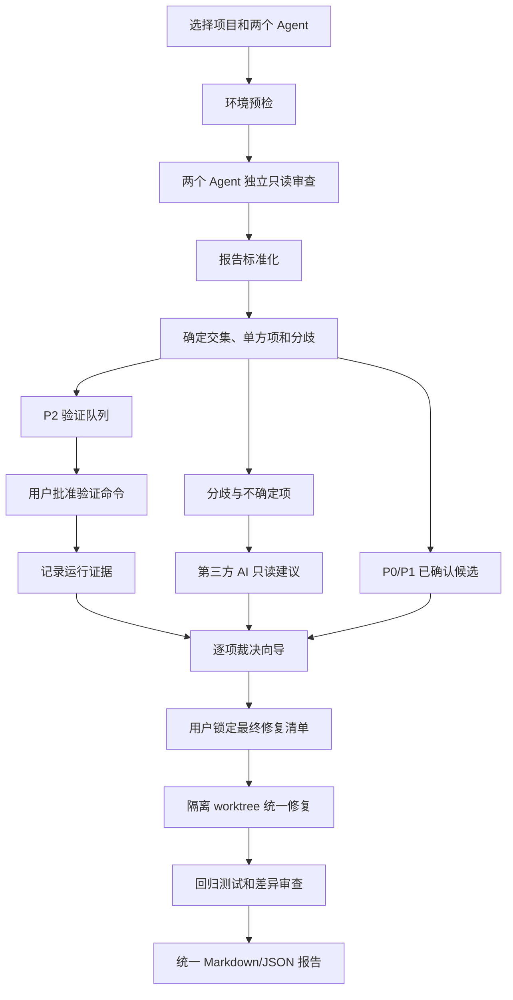

# Herdr Consensus 设计与实施文档

> 文档状态：已批准，实现中  
> 当前阶段：阶段 1 — 工程骨架、插件清单与 `doctor` 环境检查（已完成）  
> 下一阶段：阶段 2 — 状态存储和运行状态机  
> 最后更新：2026-08-18

## 1. 项目摘要

Herdr Consensus 是一个独立的 Herdr 插件，用来把两个本地 Coding Agent 对同一项目的独立审查，转化为一份可验证、可裁决、可追踪的统一修复计划。

核心流程固定为：

1. 两个 Agent 在彼此隔离、互不可见的上下文中审查同一项目。
2. 插件收集并标准化两份报告。
3. 确定交集、单方发现和真正的分歧。
4. P0/P1 已确认问题进入“必须修复”候选集。
5. P2 问题先生成验证方案，运行后归类为已确认、已排除或仍不确定。
6. 分歧项和仍不确定项交给第三方 AI 提供只读建议。
7. 用户在逐项裁决向导中作最终决定。
8. 把已确认 P0/P1、验证成立的 P2、用户批准的争议项合并为一份不可静默变更的修复清单。
9. 用户批准后，在隔离 Git worktree 中统一修复、测试和回归。
10. 导出包含证据、决定、修改和测试结果的统一报告。

本插件的定位是“多 Agent 审查共识与人工裁决层”，不是新的通用 Agent 编排器，也不替代 Herdr。

## 2. 目标与非目标

### 2.1 产品目标

- 支持 Herdr 已支持的任意 Agent 类型，不把实现绑定到 Codex 或 Claude Code。
- 支持“插件启动两名 Agent”和“导入两份现有报告”两种入口。
- 把严重程度与处理状态分开，避免把 P1、已确认、分歧混成一个概念。
- 对自动匹配保持保守：宁可交给用户确认，也不错误合并两个不同问题。
- 第三方 AI 只提供建议，不拥有最终决定权，也不能在仲裁阶段修改代码。
- 所有重要操作可恢复、可追踪；关闭 Herdr 后可以继续同一次审查。
- 默认不向外部服务上传代码；实际使用哪个 Agent、模型和命令必须记录在报告中。
- 面向新手：每一步说明当前发生什么、为什么、下一步是什么。

### 2.2 非目标

- 不修改或 fork Herdr 核心。
- 不自建模型服务，不代理或保存用户的模型 API Key。
- 不声称 AI 报告等同于真实缺陷；没有证据的结论必须标记为未验证。
- 不在 v1 自动合并分支、推送远程仓库、创建 PR、部署或执行数据库迁移。
- 不在 v1 替代 SAST、依赖漏洞扫描、移动端真机测试或人工安全审计。
- 不在非 Git 项目中自动修改代码；这类项目只能完成审查、裁决和导出修复计划。

## 3. 核心概念

### 3.1 严重程度

| 等级 | 定义 | 默认处理 |
| --- | --- | --- |
| P0 | 可造成广泛数据破坏、远程利用、生产完全不可用等紧急问题 | 阻止后续发布；确认后必须进入修复清单 |
| P1 | 可复现崩溃、重要数据丢失、权限绕过、主流程不可用 | 确认后必须进入修复清单 |
| P2 | 有实际影响，但需要特定条件、运行验证或影响有限 | 先验证；验证成立后进入修复清单 |
| P3 | 低风险缺陷、可维护性问题或非阻塞改进 | 默认记录和延期，用户可主动加入修复清单 |

严重程度不是证据强度。一个 Agent 声称某项为 P0，不代表该项已经确认。

### 3.2 处理状态

- `common_confirmed`：两份报告指向同一问题，证据相容，没有实质冲突。
- `single_source`：只有一个 Agent 提出，需要补充证据或用户判断。
- `needs_validation`：需要运行命令、测试、复现步骤或环境信息才能确定。
- `disputed`：两个 Agent 对问题是否存在、严重程度、根因或修复方式有实质冲突。
- `validated_true`：运行验证支持问题存在。
- `validated_false`：运行验证支持问题不存在或已被现有保护覆盖。
- `inconclusive`：验证无法完成或结果不足。
- `approved_fix`：用户批准进入最终修复清单。
- `deferred`：用户确认存在但本轮延期。
- `rejected`：用户决定本轮不处理，并保留理由。

### 3.3 证据等级

由强到弱：

1. `runtime_reproduced`：实际复现、测试失败、崩溃日志或可重复命令结果。
2. `code_proven`：代码路径与条件可以静态证明，包含准确文件和位置。
3. `corroborated`：两个独立 Agent 提出相容结论，但尚未运行复现。
4. `agent_asserted`：只有 Agent 文字判断，没有足够代码或运行证据。
5. `unknown`：来源或证据无法解析。

## 4. 用户工作流



### 4.1 新手默认路径

1. 在目标仓库的 Herdr pane 中运行“New consensus review”。
2. 插件自动发现 Herdr、Git、Node.js、可用 Agent 和当前仓库。
3. 系统推荐两个不同的 Agent，用户可以替换。
4. 显示将要发送的只读审查提示，用户确认后启动。
5. 两个 Agent 完成后自动进入比较页。
6. 需要验证的命令逐条展示；任何命令执行前都需要用户批准。
7. 系统为第三方建议者推荐一个与前两者不同的 Agent；用户可以接受或替换。
8. 用户逐项选择“修复、延期、不处理”。
9. 插件生成带摘要哈希的最终修复清单，再次确认后才进入修改阶段。

### 4.2 已有报告入口

用户可以导入 Markdown、纯文本或符合 schema 的 JSON 报告。导入内容仍要经过标准化和来源标记，不假设其来自可信 Agent。

## 5. 系统架构

### 5.1 总体结构

```text
Herdr plugin action / CLI
          |
          v
   Run Orchestrator
     |    |     |
     |    |     +--> State Store / Audit Log
     |    +--------> Herdr Agent Adapter
     +-------------> Import Adapter
          |
          v
   Report Normalizer
          |
          v
   Consensus Engine
     |           |
     v           v
Validation     Third-AI Arbiter
 Planner             |
     +--------+-------+
              v
      Decision Wizard
              |
              v
       Locked Fix Plan
              |
              v
   Worktree Fix Executor
              |
              v
      Unified Reporter
```

### 5.2 组件职责

#### Herdr Agent Adapter

- 通过官方 `herdr` CLI 调用 Agent 能力，不解析私有 socket 协议。
- 使用 `HERDR_PLUGIN_CONTEXT_JSON`、`HERDR_WORKSPACE_ID`、`HERDR_TAB_ID`、`HERDR_PANE_ID` 锁定调用上下文。
- 使用 `herdr pane split --current --cwd ... --no-focus` 创建 pane。
- 使用 `herdr agent start <name> --kind <kind> --pane <id>` 启动用户选择的 Agent。
- 使用 `herdr agent prompt ... --wait` 提交任务并等待稳定状态。
- 使用 `herdr agent get/read` 获取状态和输出。
- 使用 `herdr agent list`（返回 JSON）发现当前会话中已识别的 Agent；阶段 1 的 `doctor` 用它报告可用 Agent。
- 所有公开 ID 视为不透明字符串；不从 ID 格式推断状态。
- Agent 启动失败、阻塞或退出时保存现场，不自动重启超过一次。

#### Report Collector

- 为两名审查者生成同一份、版本化的审查契约。
- 两名 Agent 不得读取对方的输出、标准化结果或提示补充内容。
- 要求终端输出在唯一标记之间返回 JSON；不要求 Agent 向目标仓库写文件。
- JSON 解析失败时最多发送一次格式修复请求；再次失败则保存原始输出，转为人工导入。
- 保留原始输出及 SHA-256，标准化报告不能覆盖原文。

#### Report Normalizer

- 用 Zod schema 校验报告版本和字段。
- 将绝对路径转换为仓库相对路径；拒绝 `..` 越界和仓库外路径。
- 将各 Agent 的严重程度文字映射到 P0–P3，并保留原始等级。
- 统一行号、符号名、类别、根因、影响、证据、复现步骤和建议修复。
- 对无法确定的值使用显式 `null` 或 `unknown`，禁止自行补造。

#### Consensus Engine

- 第一层使用确定性规则匹配：相同文件、重叠行区间、相同符号、相同类别和相同错误标识。
- 第二层使用本地文本相似度计算候选分数，不调用模型。
- 建议权重：路径 0.30、位置/符号 0.20、类别 0.15、标题与根因 token 0.25、修复意图 0.10。
- 分数 `>= 0.80` 且不存在互斥证据时自动合并。
- 分数 `0.55–0.79` 标为“可能相同”，交给第三方 AI 判断是否同一问题，并在用户界面显示两份原文。
- 分数 `< 0.55` 保持为两个独立发现。
- 自动合并后的严重程度取更高等级，但报告必须显示两名 Agent 各自的原始判断。
- 下列情况强制标记为 `disputed`：存在/不存在冲突、根因互斥、修复方案互斥、严重程度相差两级以上、一个报告认为已有保护而另一个认为保护失效。

#### Validation Planner

- 从发现中的复现步骤、项目类型和现有脚本生成候选验证命令。
- 只建议仓库已有、可解释的检查入口，例如 `npm test`、`pnpm test`、`cargo test`、`pytest`、`go test ./...`、`./gradlew test`。
- Agent 提供的任意 shell 字符串不能直接执行。
- 禁止或要求额外确认的内容包括：`sudo`、删除命令、磁盘格式化、远程部署、数据库迁移、凭据读取、`curl | sh`、向生产服务写数据。
- 每条命令先展示 cwd、argv、预计写入范围和超时；使用参数数组启动，不经 shell 插值。
- 保存 stdout、stderr、退出码、耗时、环境摘要和输出哈希。
- 结果只能是 `validated_true`、`validated_false` 或 `inconclusive`；失败执行不等于问题成立。

#### Third-AI Arbiter

- 系统优先推荐未参与前两份报告的 Agent；用户可以选择其他已安装 Agent。
- 启动独立、只读的新会话，不能看到用户未授权的其他项目或历史会话。
- 输入包含：争议项原文、相关代码片段、已执行验证结果、项目规则和严格输出 schema。
- 输出必须包含：建议结论、理由、引用证据、置信度、仍缺少的验证、推荐用户动作。
- 第三方 AI 不能修改代码、不能改变原始报告、不能替用户作最终决定。
- 若第三方 AI 与前两个 Agent 使用相同模型或同一提供商，界面显示“独立性较弱”提示。
- 解析失败时允许一次格式修复；失败后保留为 `inconclusive`，不得悄悄采用自然语言结论。

#### Decision Wizard

- 默认使用逐项向导，而不是一次展示超长报告。
- 每页同时显示：两个 Agent 的原文、标准化摘要、证据、验证结果、第三方建议和差异说明。
- 用户动作固定为：`加入修复`、`延期`、`不处理`、`返回补充验证`。
- 每个决定记录时间、选择、可选理由和当时证据哈希。
- 用户可以返回修改未锁定决定；锁定后任何变化都生成新的修复计划版本。

#### Locked Fix Plan

- 汇总三类内容：已确认 P0/P1、验证成立的 P2、用户批准的争议或单方项。
- P3 只有用户明确选择后才能加入。
- 生成 `fix-plan.json` 和 `fix-plan.md`，并对规范化 JSON 计算 SHA-256。
- 任何后续实现提示都引用 `run_id`、计划版本和哈希。
- 实现 Agent 不得增加未在清单中的顺手重构；新发现要回到裁决流程形成新版本。

#### Worktree Fix Executor

- v1 自动修改仅支持干净的 Git 仓库。
- 在独立 worktree 和独立分支中执行修改，不直接写主工作目录。
- 用户选择一个写入 Agent；默认不让两个 Agent 同时改同一份代码，避免冲突和责任不清。
- 写入 Agent 接收锁定清单、验收条件和禁止范围。
- 每完成一个问题运行其针对性测试；全部完成后运行项目级回归命令。
- 不自动 commit、merge、push、创建 PR 或发布。最终由用户审查 diff 后决定。

#### Unified Reporter

- 导出 Markdown 和 JSON。
- 包含运行元数据、Agent/模型信息、原始发现映射、共识结果、验证命令与结果、第三方建议、用户决定、最终修复清单、实际变更文件和回归结果。
- 报告明确区分事实、Agent 判断、第三方建议和用户决定。

## 6. 数据模型

以下接口名称在实现中视为稳定契约；调整前必须先修改本文档。

```ts
type Severity = "P0" | "P1" | "P2" | "P3";
type EvidenceTier =
  | "runtime_reproduced"
  | "code_proven"
  | "corroborated"
  | "agent_asserted"
  | "unknown";

interface SourceLocation {
  path: string;
  startLine: number | null;
  endLine: number | null;
  symbol: string | null;
}

interface RawReportArtifact {
  sourceId: "agent_a" | "agent_b" | "third_ai" | "import";
  agentKind: string;
  model: string | null;
  capturedAt: string;
  content: string;
  sha256: string;
}

interface NormalizedFinding {
  findingId: string;
  sourceId: string;
  originalSeverity: string;
  severity: Severity;
  title: string;
  category: string;
  location: SourceLocation | null;
  rootCause: string | null;
  impact: string;
  evidence: string[];
  evidenceTier: EvidenceTier;
  reproduction: string[];
  suggestedFix: string | null;
  needsRuntimeValidation: boolean;
  rawArtifactSha256: string;
}

interface ConsensusItem {
  itemId: string;
  findingIds: string[];
  relation: "common" | "single_source" | "possible_match" | "disputed";
  matchScore: number | null;
  severity: Severity;
  evidenceTier: EvidenceTier;
  disagreementReasons: string[];
  status: string;
}

interface ValidationRecord {
  validationId: string;
  itemId: string;
  argv: string[];
  cwd: string;
  approvedByUser: boolean;
  startedAt: string | null;
  finishedAt: string | null;
  exitCode: number | null;
  stdoutSha256: string | null;
  stderrSha256: string | null;
  conclusion: "validated_true" | "validated_false" | "inconclusive";
}

interface ArbitrationAdvice {
  itemId: string;
  recommendation: "fix" | "defer" | "reject" | "validate_more";
  rationale: string;
  evidenceRefs: string[];
  confidence: "low" | "medium" | "high";
  missingValidation: string[];
  artifactSha256: string;
}

interface UserDecision {
  itemId: string;
  decision: "approved_fix" | "deferred" | "rejected" | "validate_more";
  reason: string | null;
  decidedAt: string;
  evidenceSnapshotSha256: string;
}

interface LockedFixPlan {
  runId: string;
  version: number;
  items: Array<{
    itemId: string;
    severity: Severity;
    acceptanceCriteria: string[];
    allowedPaths: string[];
  }>;
  createdAt: string;
  sha256: string;
}
```

## 7. 本地状态与隐私

### 7.1 状态目录

插件不在审查阶段污染目标仓库。状态默认保存到：

```text
$XDG_STATE_HOME/herdr-consensus/
  projects/<sha256(real-repo-path)>/
    runs/<run-id>/
      run.json
      raw/
      normalized/
      consensus.json
      validations/
      arbitration/
      decisions.json
      fix-plan.json
      fix-plan.md
      logs/
      final-report.md
      final-report.json
```

macOS 未设置 `XDG_STATE_HOME` 时使用 `~/Library/Application Support/herdr-consensus/`；Linux 回退到 `~/.local/state/herdr-consensus/`。

### 7.2 原子性和恢复

- JSON 使用临时文件、`fsync`、原子 rename 写入。
- `run.json` 保存状态机阶段和 schema 版本。
- 每次阶段转换追加审计事件；重复执行同一步必须幂等。
- 发现 schema 不兼容、哈希不一致或部分写入时停止并显示恢复建议，不猜测状态。
- 默认保留本地记录，不自动上传；删除记录必须由用户明确执行。

### 7.3 凭据与外部模型

- 插件不读取或保存 API Key。
- Agent 使用各自 CLI 已配置的认证。
- 启动前显示所选 Agent；能检测到模型名称时一并显示，检测不到则记录 `unknown`。
- 第三方服务是否收到代码取决于用户选择的 Agent。首次使用某个非本地 Agent 前必须明确提示。

## 8. CLI 与 Herdr 插件入口

### 8.1 CLI

```text
herdr-consensus doctor
herdr-consensus start --agent-a <kind> --agent-b <kind>
herdr-consensus import --agent-a <report> --agent-b <report>
herdr-consensus status [run-id]
herdr-consensus resume <run-id>
herdr-consensus validate <run-id>
herdr-consensus arbitrate <run-id> --agent <kind>
herdr-consensus decide <run-id>
herdr-consensus lock <run-id>
herdr-consensus apply <run-id> --agent <kind>
herdr-consensus report <run-id> --format md|json
```

所有命令支持 `--json` 返回机器可读结果。会修改代码或执行验证的命令不提供隐式 `--yes` 默认值。

### 8.2 Herdr Actions

- `new-review`：在当前 workspace 启动新审查。
- `resume-review`：选择未完成运行并继续。
- `open-decision-wizard`：打开逐项裁决向导。
- `open-final-report`：打开最近一次统一报告。

`herdr-plugin.toml` 的命令仅负责定位插件入口；业务逻辑全部进入受测试的 TypeScript 模块。

## 9. 技术栈与目录规划

### 9.1 技术栈

- Node.js 20 或更高版本，使用 ESM。
- TypeScript，开启 `strict`、`noUncheckedIndexedAccess` 和 `exactOptionalPropertyTypes`。
- pnpm + lockfile，保证可重复安装。
- Zod：运行时 schema 校验。
- `@inquirer/prompts`：逐项裁决交互。
- `smol-toml`：读取用户配置；插件 manifest 仍为普通 TOML。
- `picocolors`：最小终端样式。
- Node `child_process.spawn`：以 argv 数组调用 Herdr、Git 和测试命令，不拼接 shell 字符串。
- Vitest：单元和集成测试。
- `fast-check`：匹配算法、状态机和路径规范化的性质测试。
- tsup：生成可分发的单入口 ESM bundle。
- v1 使用原子 JSON 文件存储，不引入数据库。

具体依赖版本在阶段 1 创建 lockfile 时固定；未经设计调整不引入 Web 服务、Electron、Docker或数据库。

### 9.2 计划目录

```text
herdr-consensus/
  AGENTS.md
  CLAUDE.md
  CHANGELOG.md
  DESIGN.md
  LICENSE
  README.md
  herdr-plugin.toml
  package.json
  pnpm-lock.yaml
  tsconfig.json
  vitest.config.ts
  src/
    cli.ts
    commands/
    herdr/
    reports/
    consensus/
    validation/
    arbitration/
    decisions/
    fix-plan/
    apply/
    reporting/
    state/
    security/
    ui/
  schemas/
    review-report.v1.json
    final-report.v1.json
  prompts/
    independent-review.md
    arbitration.md
    implementation.md
  tests/
    unit/
    integration/
    fixtures/
    e2e/
```

每个模块只承担一个职责；Herdr 调用、状态存储、算法和终端 UI 不能混在同一文件中。

## 10. 错误处理与安全约束

- 找不到 Herdr、Node、Git 或 Agent 时，`doctor` 给出精确缺项，不自动安装。
- 目标路径必须经过 `realpath`，所有报告位置必须限制在仓库根目录内。
- Agent 输出一律视为不可信输入，做大小限制、schema 校验和终端控制字符清理。
- 每份报告默认最大 2 MiB；超限保留截断说明并要求重新生成。
- 子进程设置超时和输出上限；超时后先请求正常终止，再提供用户可见的强制停止选择。
- 任何 `blocked` 状态都显示 Agent 最近输出，由用户决定继续输入或取消。
- 不自动执行报告里的命令、代码块或 URL。
- 不把自然语言中的“已修复”“测试通过”当作事实，必须绑定实际命令结果或 Git diff。
- 未锁定修复清单前禁止进入写入 Agent。
- worktree 创建前要求主仓库无未说明的工作区冲突；不使用 `git reset --hard`、`git checkout --` 或强制清理用户文件。
- 测试失败时保留 worktree 和日志，不能为了得到绿色结果而删除测试或建立 lint baseline。

## 11. 测试策略与验收标准

### 11.1 单元测试

- 路径规范化与仓库越界防护。
- schema 校验、严重程度映射和原始字段保留。
- 精确匹配、相似匹配阈值、冲突检测和去重。
- P0–P3 与状态转换互不污染。
- 验证命令策略、危险参数阻断和超时。
- 修复清单规范化和哈希稳定性。
- 原子状态写入、崩溃恢复和幂等重放。

### 11.2 集成测试

- 使用假的 `herdr` 可执行文件模拟 Agent 启动、完成、阻塞、退出和格式错误。
- 两份固定报告经过标准化后得到稳定的交集/分歧快照。
- 第三方 AI 返回有效、无效和矛盾 JSON 时的处理。
- 用户裁决后生成正确的锁定清单。
- Git fixture 中创建隔离 worktree，不改动主工作目录。

### 11.3 端到端测试

- 在真实 Herdr 中用两个可用 Agent 对 fixture 仓库完成一次只读审查。
- 完成一项 P1 共识、一项 P2 验证和一项分歧裁决。
- 锁定清单后由写入 Agent 在 worktree 修复。
- 运行回归命令，导出报告，并人工确认主仓库未被自动修改。

### 11.4 发布门槛

- `pnpm lint`、`pnpm typecheck`、`pnpm test`、`pnpm build` 全部通过。
- macOS 和 Linux 至少各完成一次无模型的 fixture 集成测试。
- 至少完成 Codex + Claude、Codex + Pi 两种真实 Agent 组合的只读烟雾测试；若环境不可用，发布说明必须明确未验证组合。
- README 安装、卸载和恢复流程由一个未参与开发的人照做成功。
- 插件预览中不包含不必要的网络下载或高权限命令。

## 12. 实现顺序与进度

状态值仅使用：`未开始`、`进行中`、`已完成`、`阻塞`。完成每个阶段后必须更新本表，并在 `CHANGELOG.md` 追加实际变更。

| 阶段 | 状态 | 交付物 | 验收门槛 |
| --- | --- | --- | --- |
| 0. 文档和协作规则 | 已完成 | DESIGN、CHANGELOG、AGENTS、CLAUDE | 四份文档存在；两份规则文档内容完全一致 |
| 1. 工程骨架和 doctor | 已完成 | package、TS 配置、manifest、CLI、环境检查 | `doctor` 能报告 Herdr/Node/Git/Agent；测试通过 |
| 2. 状态存储和运行状态机 | 未开始 | 原子 JSON store、run schema、审计事件、resume | 崩溃 fixture 可恢复；重复执行不破坏状态 |
| 3. Herdr Agent Adapter | 未开始 | pane/agent start、prompt、wait、read、错误分类 | fake Herdr 集成测试覆盖完成/阻塞/退出/超时 |
| 4. 双 Agent 独立审查 | 未开始 | 统一 prompt、并行运行、原始报告收集、导入模式 | 两 Agent 互不可见；无效 JSON 有一次修复机会 |
| 5. 标准化与共识引擎 | 未开始 | schema、normalizer、matcher、dispute detector | fixture 交集/分歧稳定；性质测试通过 |
| 6. P2 验证系统 | 未开始 | 命令计划、批准界面、安全执行、证据记录 | 危险命令被阻止；通过/失败/不确定正确归类 |
| 7. 第三方 AI 建议 | 未开始 | 推荐/替换 Agent、只读仲裁 prompt、建议解析 | 不改代码；来源、模型、置信度和证据完整记录 |
| 8. 用户逐项裁决向导 | 未开始 | 交互 UI、决定持久化、返回补验证 | 可恢复；每项决定绑定证据快照 |
| 9. 锁定修复清单 | 未开始 | fix-plan JSON/MD、版本和 SHA-256 | 修改决定会生成新版本；旧版本不可覆盖 |
| 10. worktree 统一修复 | 未开始 | Git 安全检查、隔离 worktree、写入 Agent、定向测试 | 主工作目录不变；禁止越过锁定清单 |
| 11. 回归与统一报告 | 未开始 | 全量测试、diff 摘要、Markdown/JSON 报告 | 报告能追溯每个问题到证据、决定和修改 |
| 12. 文档、真实烟雾测试和首发 | 未开始 | README、许可证、安装包、兼容性矩阵 | 发布门槛全部满足；无已知 P0/P1 |

### 12.1 阶段执行规则

每个阶段按以下顺序执行：

1. 阅读本设计和当前阶段验收门槛。
2. 为该阶段行为写失败测试。
3. 运行测试并确认因缺少目标行为而失败。
4. 实现能通过测试的最小功能。
5. 运行定向测试，再运行现有完整测试。
6. 自查安全边界、用户数据和跨模块接口。
7. 更新本表状态和必要的设计说明。
8. 在 `CHANGELOG.md` 追加修改文件、修改原因、验证结果和下一位维护者注意事项。
9. 形成一个范围清晰的 Git commit；不要把多个阶段揉进同一提交。

## 13. 借鉴来源与使用边界

本项目借鉴公开项目的产品概念和工作流，不复制其代码。真正复用任何实现前，必须再次核对当时的许可证、版本和 API。

| 来源 | 借鉴内容 | 不照搬的部分 |
| --- | --- | --- |
| [Herdr 官方插件文档](https://github.com/herdrdev/herdr/blob/master/docs/next/website/src/content/docs/plugins.mdx) | `herdr-plugin.toml`、插件 action、上下文变量、插件自有状态、安装安全提示 | 不修改 Herdr 内核，不依赖私有实现 |
| [Herdr 官方 Agent Skill](https://github.com/herdrdev/herdr/blob/master/skills/herdr/SKILL.md) | `agent start/prompt/wait/read` 的公开调用方式、稳定 ID 和 caller context 规则 | 不解析终端画面猜测状态，不硬编码 Agent 列表 |
| [StructuPath/herdr-conductor](https://github.com/StructuPath/herdr-conductor) | 严格报告契约、规范化 JSON、失败关闭、状态与代码修改边界 | 不复制其复杂交付编排，不绑定单一 Herdr 小版本，不采用未实现的 Stage 3 |
| [overflowy/herdr-adversarial-review](https://github.com/overflowy/herdr-adversarial-review) | `Confirmed / Disputed / Unverified` 思路和让第二模型质疑结论的价值 | 不固定 Claude 主控或 GPT 审查，不使用其代理与 safehouse 安装链，不让主 Agent代替用户裁决 |
| [aemrebarut/herdr-dagr](https://github.com/aemrebarut/herdr-dagr) | 把“Agent 声称完成”与“已有证据验证”分开、保留运行历史 | v1 不做 5+ Agent DAG 编排和复杂图形界面 |
| [Elio2000/herdr-peer-review](https://github.com/Elio2000/herdr-peer-review) | 第二 Agent 独立、只读、可观察的 pane 工作方式 | 不采用自动 peer 决策，不把审查范围限制为当前 diff |
| [persiyanov/herdr-reviewr](https://github.com/persiyanov/herdr-reviewr) | 面向人的逐项审查体验、意见回传和只读查看 | 不复制其 Rust UI，不把功能限制为 PR/diff 评论 |
| [yigitkonur/awesome-herdr](https://github.com/yigitkonur/awesome-herdr) | 用于持续排查生态重复功能和兼容项目 | 不把目录中的项目当作官方背书 |

Herdr 核心采用 Apache-2.0。设计阶段没有复制上述第三方仓库代码；实现阶段如需引用代码，必须在 `NOTICE` 和源码注释中完成归属，并遵守对应许可证。

## 14. 已确定的产品决策

- 项目名称：`herdr-consensus`。
- 形态：独立 Herdr 插件，不 fork Herdr。
- 主界面：逐项裁决向导；完成后生成长报告。
- 匹配策略：确定性规则优先，文本相似度辅助，边界项由第三方 AI 建议。
- 第三方 AI：系统推荐，用户可替换；独立只读会话；用户拥有最终决定权。
- 修复策略：三类已批准问题合并后一次锁定，在隔离 worktree 中统一修复。
- 存储：插件自有原子 JSON 文件；v1 无数据库、Docker 和云端后端。
- 支持范围：审查和裁决可用于一般项目；自动修复 v1 要求 Git。
- 发布策略：首版优先做好本地可靠性，不自动 push、PR 或部署。

## 15. 设计变更流程

如实现中发现 Herdr API、终端能力或安全边界与本文不符：

1. 停止相关代码修改。
2. 在本文件中写明原决定、实际证据、拟议调整及对后续阶段的影响。
3. 更新数据接口、阶段顺序和验收标准。
4. 在 `CHANGELOG.md` 记录设计变更。
5. 再继续实现。

不得先写代码、再补文档合理化既成事实。
